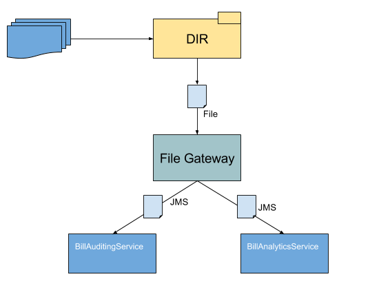

#File Gateway

##Introduction

##What you will learn 

- Listening to incoming file with file connector. 
- Reading file using I/O records API.
- Using JMS topics with Ballerina.

##Scenario - Async Messaging

###Description
XtreamEnergy Inc would wish to incorporate their current file based system with the new services 
"BillAuditingService" and "BillAnalyticsService".

- Currently XtreamEnergy maintains all the billing information of users in a spreadsheet. The records of each user is 
exported to a CSV file monthly. Each record in the CSV contains the fields name,id and the amount paid by the user in 
the relevant month.   
- BillAuditingService and BillAnalyticsService expects to process each record of users separately. Both the services 
expect user information in the following json format

```
 {
    "name":<<NameOfUser>>,
    "id":<<IdOfUser>>,
    "amount":<<AmountPaid>>
 }
``` 



###Solution
The CSV file could be read using file connector. Each record in the CSV should be scattered and transformed into a 
json that is expected by the services ("BillAuditingService" and "BillAnalyticsService"). The transformed message 
will be placed into a JMS topic. Where two consumers will bind to the topic to receive and distribute the messages 
between "BillAuditingService" and "BillAnalyticsService".

###Building the Scenario

In order to build the scenario we would need the following,

- Service which will act as the 
  
- Service which will act as the
 
- Service which will act as the gateway, which will read the CSV file, scatter the records and dispatch it to topic.
 
- JMS service which will consume from topic and dispatch the request to BillAuditingService.

- JMS service which will consume from topic and dispatch the request to BillAnalyticsService.


Composing the above services billing.balx was created.

###Testing Scenario

####Sample Setup

1. Start message broker by running the following command,

bin$ ./broker.sh

2. Deploy the billing service by running the following command,
 
bin$ ./integrator.sh ../samples/file-gateway/billing.balx

####Invoking the Service

1. Navigate to ../samples/file-gateway/resources directory 
2. Copy the file Jan_2018_bills.csv to ../samples/file-gateway/resources/bills folder (given that the 
FileProcessingGateway service listens to "bills" directory).

####Observations 

The following log will be displayed in the ballerina instance,

```
../samples/file-gateway/resources/bills/Jan_2018_bills.csv
Analytics service received the request: {"name":"User3","id":"49484","amount":"3849"}
Analytics service received the request: {"name":"User1","id":"19292","amount":"2000"}
Analytics service received the request: {"name":"User2","id":"48944","amount":"4000"}
Audit service received the request: {"name":"User2","id":"48944","amount":"4000"}
Audit service received the request: {"name":"User3","id":"49484","amount":"3849"}
Audit service received the request: {"name":"User1","id":"19292","amount":"2000"}
```

Given that there're 3 users in the CSV record each users records is processed by both "BillAnalyticsService" and 
"BillAuditingService" 
