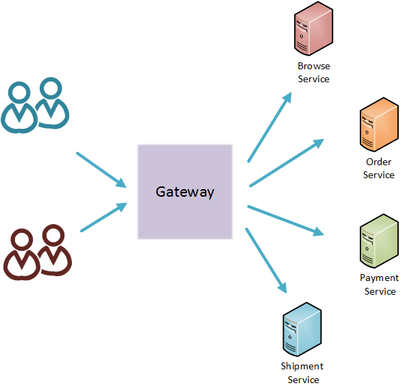

# Message Routing Gateway Scenario

## Scenario

The scenario is about an eCommerce API router.
An eCommerce system consists of several microservices which provides a specific functionality.
Those services are not exposed externally.
To expose those functionality to the outside, it is required to create a routing service which acts as a gateway.
So the external applications can consume them through the Gateway service.

Following are the available microservices.

Browse Service:
browse available items

Order Service:
place an order

Payment Service:
make the payment

Shipment Service:
submit shipment details

So we need a single service or a gateway which routes the incoming traffic from various clients into above microservices.




## Requirements

Following are some of the key requirement of the gateway.

### Routing based on url
Gateway service provides a single API to the outside which can be consumed by external applications.
 So it need to route the incoming requests into appropriate microservice based on the url.

### Routing based on headers
Gateway service is accessed by internal systems in the organization too. Those systems need special access to those microservices.
‘User-Agent’ header present in the request can be used to identify the internal system.
Here shipment requests needed to be routered to appropriate resource based on the value of the ‘User-Agent’ header.

### Manipulating headers
Since Gateway acts as an intermediate hop, it is required to add the X-Forwarded-For header to the request.


### Content-based routing
There are multiple payment services exists which handles different type of payment methods.
Payment type can be determined using the “PaymentType” element of the payment request.
Payment request need to be routed to the correct service based on the content of payment request message.


## Building the scenario

To build the Gateway we are going to use a ballerina HTTP service.

Following is the configuration for the complete service built in ballerina.

```
package samples.router;

import ballerina.net.http;

@http:configuration {basePath:"/ecom"}
service<http> GatewayService {

    endpoint<http:HttpClient> browseServiceEP {
        create http:HttpClient("http://localhost:9090/browse", {});
    }

    endpoint<http:HttpClient> orderServiceEP {
        create http:HttpClient("http://localhost:9090/order", {});
    }

    endpoint<http:HttpClient> shipmentServiceEP {
        create http:HttpClient("http://localhost:9090/shipment", {});
    }

    endpoint<http:HttpClient> paymentServiceEP {
        create http:HttpClient("http://localhost:9090/payment", {});
    }

    @http:resourceConfig {
        methods:["GET","POST"],
        path:"/{serviceType}/*"
    }
    resource route (http:Request req, http:Response resp, string serviceType) {

        // Fetch url postfix
        var requestURL = req.getProperty("REQUEST_URL");
        string postfix = requestURL.replaceFirst("/ecom/" + serviceType, "");

        // Manipulating headers
        setXFwdForHeader(req);

        http:Response responseMessage = {};

        // Routing Logic
        if (serviceType.hasPrefix("browse")) {
            responseMessage, _ = browseServiceEP.get(postfix, req);

        } else if (serviceType.hasPrefix("order")) {
            responseMessage, _ = orderServiceEP.post("/placeOrder", req);

        } else if (serviceType.hasPrefix("payment")) {
            json payload = req.getJsonPayload();
            var cardType,_ = (string) payload.creditCardType;
            if (cardType.equalsIgnoreCase("VISA")) {
                responseMessage, _ = paymentServiceEP.post("/visa/"  + postfix, req);
            } else if (cardType.equalsIgnoreCase("Master")) {
                responseMessage, _ = paymentServiceEP.post("/master/"  + postfix, req);
            } else {
                payload = {"Error":"Invalid Payment Type"};
                responseMessage.setJsonPayload(payload);
            }

        } else if (serviceType.hasPrefix("shipment")) {
            var userAgentHeader,_ = req.getHeader("User-Agent");
            if (userAgentHeader == "Ecom-Agent") {
                responseMessage, _ = shipmentServiceEP.post("/internal/" + postfix, req);
            } else {
                responseMessage, _ = shipmentServiceEP.post("/submit/" + postfix, req);
            }

        } else {

            json payload = {"Error":"No service found"};
            responseMessage.setJsonPayload(payload);
        }
        resp.forward(responseMessage);
    }
}

function setXFwdForHeader(http:Request req) {
    var xFwdHeader,_ = req.getHeader("X-Forwarded-For");

    if (xFwdHeader != "") {
        xFwdHeader = xFwdHeader + ", 10.100.1.127";
    } else {
        xFwdHeader = "10.100.1.127";
    }
    println("Setting X-Forwarded-For to : " + xFwdHeader);

    req.addHeader("X-Forwarded-For", xFwdHeader);
}

````

## Test the scenario


### How to run the sample

```
bin$ ./integrator.sh ../samples/message-router/router.balx
```

### Executing Sample

#### Browse Electronics items

Invoke the service using cURL as follows

```
curl -v http://localhost:9090/ecom/browse/Electronics
```

You should get something similar to following as the output.

```
{
   "Phones":[
      {
         "model":"S7 Edge",
         "brand":"Samsung"
      },
      {
         "model":"S8 Edge",
         "brand":"Samsung"
      },
      {
         "model":"IphoneX",
         "brand":"Apple"
      }
   ],
   "Televisions":[
      {
         "model":"LF530 Smart",
         "brand":"LG"
      },
      {
         "model":"M5000",
         "brand":"Samsung"
      }
   ]
}
```


#### Submitting a order


Create a order.json file with the following content.
```
{
   "order":[
      {
         "category":"Electronics",
         "item":{
            "subcategory":"Phones",
            "model":"S7 Edge",
            "brand":"Samsung"
         }
      }
   ]
}
```
Invoke the service using cURL as follows
```
curl -v http://localhost:9090/ecom/order/placeOrder -d@order.json
```

You should get something similar to following as the output.

```
{"Status":"Order placed successfully","OrderId":379}
```


#### Make the payment


Create a payment.json file with the following content.
```
{
   "creditCardType":"VISA",
   "card":{
      "no":"1234098618781768",
      "cvv":"123"
   }
}
```

Invoke the service using cURL as follows
```
curl -v http://localhost:9090/ecom/payment/371 -d@payment.json
```

You should get something similar to following as the output.
```
{"Status":"Transaction made through your VISA card is successful for order : 371"}
```

#### Submit for shipment

Create a shipment.json file with the following content.

```
{
   "fullName": "John Martin",
   "shipmentType":"Normal",
   "address":{
      "street":"787 Castro st",
      "city":"mountain view",
      "state":"CA",
      "zip":"94041-2013"
   }
}
```


Invoke the service using cURL as follows
```
curl -v http://localhost:9090/ecom/shipment/371 -d@../resources/shipment.json
```


You should get something similar to following as the output.
```
{"Status":"Shipment details submitted","Order ID":"371"}
```

Invoke as the internal system specifying the ‘User-Agent’ header
```
curl -v http://localhost:9090/ecom/shipment/371 -d@../resources/shipment.json -H "User-Agent: Ecom-Agent"
```

You will see following in the log
```
Submitting internal shipment details to order id: 371
```


#### Manipulating Headers

For every request, you will notice following is getting printed in the log.
Please refer to the setXFwdForHeader() function in the RoutingService.bal for more information about manipulating headers.

```
Setting X-Forwarded-For to : 10.100.1.127
```
